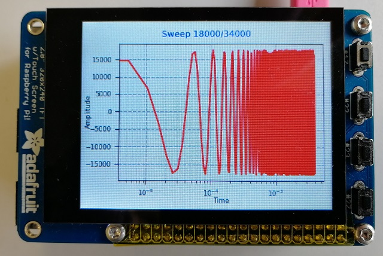

# Sweep Generator on RPi 
Generates sweep signal in two modes impulse and constantly.
Used pygame-1.9.5,  Adafruit PiTFT - 2.8" Touchscreen Display for Raspberry Pi, pimoroni - Audio DAC SHIM (Line-Out).
in Display, you need to cut the grio 18. 

"menu settings" are under development. maybe they will be later.
# install PiTFT
https://learn.adafruit.com/adafruit-2-8-pitft-capacitive-touch

git clone https://github.com/adafruit/Raspberry-Pi-Installer-Scripts.git

sudo python3 adafruit-pitft.py --display=28c --rotation=90 --install-type=console

# edit in /boot/config.txt
#dtparam=audio=on

dtoverlay=hifiberry-dac

# edit for user PI
sudo adduser pi tty

sudo chmod g+rw /dev/tty0

# edit udev
sudo nano /lib/udev/rules.d/50-udev-default.rules

change line:

SUBSYSTEM=="tty", KERNEL=="tty[0-9]*", GROUP="tty", MODE="0620"

to:

SUBSYSTEM=="tty", KERNEL=="tty[0-9]*", GROUP="tty", MODE="0660"

# Start on boot
chmod +x sweep_gen.py

sudo vi /etc/rc.local

add vor exit 0

sudo daemon /home/pi/python/sweep_gen/sweep_gen.py

# Features
add editable settings for sweep and sin. :) 
# References:
https://github.com/wolfer649/WGOT
